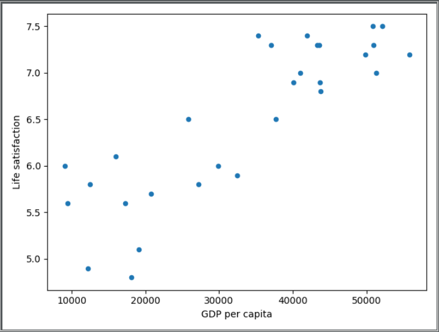

### Country Happiness Classifier

This project uses a simple Linear Regression Model to classify how happy or satisfied a country is given its GDP. 
This example is taken from Aurélien Géron's _Hands On Machine Learning_ [book](https://homl.info). 



Dependencies
---
1. Pandas
2. Numpy
3. SciKitLearn

Installation
---
1. Run ```python install -r requirements.txt```